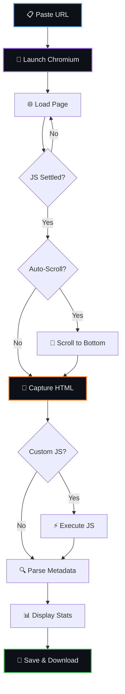

<div align="center">


<br/>

[](https://colab.research.google.com/github/Shineii86/WebScrap/blob/main/notebook/WebScrap.ipynb)
[](GUIDE.md)

<br/>

[](https://github.com/Shineii86/WebScrap/stargazers)
[](https://github.com/Shineii86/WebScrap/network/members)
[](https://github.com/Shineii86/WebScrap/issues)
[](https://github.com/Shineii86/WebScrap/commits/main)
[](https://github.com/Shineii86/WebScrap)

<br/>

[](https://www.selenium.dev/)
[](https://www.chromium.org/)
[](https://www.python.org/)
[](LICENSE)

<br/>

**No setup. No install. Just paste a URL and scrape.**

Open notebook in Google Colab, run all cells, and capture the full rendered HTML from any website — even JavaScript-heavy SPAs.

**Tags:** `web-scraping` `selenium` `chromium` `spa-scraper` `colab-notebook` `python` `html-extraction`

</div>

---

## 📑 Table of Contents

<details open>
<summary><b>Quick Navigation</b></summary>

<br/>

| Section | Description |
|:--------|:------------|
| [📖 Overview](#-overview) | What is WebScrap? |
| [📂 Project Structure](#-project-structure) | Repository layout |
| [🧩 Architecture](#-architecture) | Pipeline flow diagram |
| [⚙️ Pipeline Components](#️-pipeline-components) | Tools and engines used |
| [🚀 Quick Start](#-quick-start) | Get running in 3 steps |
| [🎛️ Scrape Parameters](#️-scrape-parameters) | All configurable options |
| [🔋 Resource Requirements](#-resource-requirements) | RAM, disk specs |
| [🐍 Python Modules](#-python-modules) | Modular source code reference |
| [🧪 Tips & Tricks](#-tips--tricks) | Get the best results |
| [❓ FAQ](#-faq) | Common questions answered |
| [🐛 Troubleshooting](#-troubleshooting) | Fix common issues |
| [🙏 Acknowledgements](#-acknowledgements) | Credits and references |
| [🤝 Contributing](#-contributing) | How to contribute |
| [📜 License](#-license) | MIT license details |

</details>

---

## 📖 Overview

WebScrap is a **full-page web scraper** for Google Colab that uses Selenium with headless Chromium to render any webpage — including JavaScript-heavy single-page applications — and capture the complete HTML after all dynamic content has loaded.

> [!NOTE]
> **Why Selenium + Chromium?** Unlike `requests` or `urllib`, Selenium runs a real browser. This means JavaScript frameworks (React, Vue, Angular, Next.js, Nuxt) execute fully before the HTML is captured. You get what the user sees, not what the server initially sends.

### ✨ Key Features

| Feature | Description |
|---------|-------------|
| 🕷️ **Full Render** | Captures HTML after complete JS execution |
| 📜 **Auto-Scroll** | Scrolls to trigger lazy-loaded content |
| ⚡ **Custom JS** | Execute your own JavaScript after load |
| 🔗 **Link Extraction** | All links with text and resolved URLs |
| 🖼️ **Image Extraction** | All images with alt text and dimensions |
| 🏷️ **Meta Tags** | Open Graph, Twitter Cards, description, keywords |
| 📄 **HTML Preview** | Syntax-highlighted preview in notebook |
| 💾 **Save & Download** | HTML + metadata JSON, ZIP export |
| ⏱️ **Configurable** | Timeout, wait time, scroll behavior |
| 🔄 **Redirect Aware** | Follows and reports all redirects |

---

## 📂 Project Structure

```
WebScrap/
├── CHANGELOG.md                # Version history (newest first)
├── CONTRIBUTING.md             # How to contribute
├── GUIDE.md                    # Beginner-friendly user guide
├── LICENSE                     # MIT
├── README.md                   # This file
├── SECURITY.md                 # Vulnerability reporting policy
├── .gitignore                  # Python, Jupyter, output files, OS artifacts
├── requirements.txt            # Python dependencies
│
├── .github/
│   ├── ISSUE_TEMPLATE/
│   │   ├── bug_report.md
│   │   └── feature_request.md
│   └── PULL_REQUEST_TEMPLATE.md
│
├── notebook/
│   └── WebScrap.ipynb          # Main Colab notebook (3 cells)
│
└── src/
    ├── __init__.py             # Package marker + shared exports
    ├── config.py               # Constants and defaults
    ├── scraper.py              # Core scraping engine
    └── ui.py                   # Colab UI components
```

---

## 🧩 Architecture



---

## ⚙️ Pipeline Components

| Component | Technology | Purpose |
|-----------|-----------|---------|
| Browser Engine | Chromium (headless) | Renders JavaScript, executes SPAs |
| Automation | Selenium WebDriver | Controls Chromium programmatically |
| HTML Parser | BeautifulSoup + lxml | Extracts links, images, meta tags |
| HTTP Fallback | requests | Fetches response headers |

---

## 🚀 Quick Start

| Step | Cell | What Happens | Duration |
|:----:|:----:|:-------------|:---------|
| 🔧 | 1. Setup | Install Chromium & Selenium | ~60s (first) / ~10s (cached) |
| 🕷️ | 2. Scrape | Paste URL → render → capture | ~5–60s per page |
| 💾 | 3. Export | Zip and download results | ~5s |

---

## 🎛️ Scrape Parameters

| Parameter | Type | Default | Description |
|-----------|------|---------|-------------|
| `url` | String | — | Website URL to scrape |
| `timeout` | Integer | 30 | Max seconds to wait for page load (10–120) |
| `wait_after_load` | Integer | 3 | Extra seconds for JS to settle (0–30) |
| `auto_scroll` | Boolean | True | Scroll to trigger lazy-loaded content |
| `custom_js` | String | "" | JavaScript to execute after load |
| `save_html_file` | Boolean | True | Save HTML to file |
| `show_preview` | Boolean | True | Display syntax-highlighted HTML preview |
| `show_links` | Boolean | True | Extract and display all links |

---

## 🔋 Resource Requirements

| Resource | Minimum | Recommended |
|----------|---------|-------------|
| Runtime | Colab free | Colab free |
| RAM | 2 GB | 4 GB+ |
| Disk | 500 MB (Chromium) | 1 GB+ |
| GPU | Not required | Not required |

---

## 🐍 Python Modules

<details>
<summary><b>src/config.py</b> — Constants and defaults</summary>

Chrome options, timeouts, UI theme tokens, output paths.

</details>

<details>
<summary><b>src/scraper.py</b> — Core scraping engine</summary>

`scrape_url()` — full render pipeline with auto-scroll, metadata extraction.
`save_html()` / `save_metadata()` — file output helpers.
`extract_text()` / `extract_links()` / `extract_images()` — HTML parsing.

</details>

<details>
<summary><b>src/ui.py</b> — Colab UI components</summary>

Theme-safe inline-styled HTML cards, stat displays, tables, and previews.
Works in both Colab dark and light modes.

</details>

---

## 🧪 Tips & Tricks

- **Heavy SPAs (Next.js, Nuxt):** Increase `wait_after_load` to 5–10 seconds
- **Infinite scroll pages:** Enable `auto_scroll` and increase timeout
- **Click-to-expand content:** Use `custom_js` to trigger buttons: `document.querySelector('.expand-btn').click()`
- **Login-gated pages:** Not supported (no auth flow) — use cookies via custom JS if needed
- **Rate limiting:** Add delays between scraping multiple pages
- **Large pages:** Increase timeout to 60–120s for pages with heavy media

---

## ❓ FAQ

<details>
<summary><b>Does it work on Next.js / React / Vue sites?</b></summary>
Yes! Selenium runs a real Chromium browser, so all JavaScript frameworks execute fully before the HTML is captured.
</details>

<details>
<summary><b>Can I scrape pages behind login?</b></summary>
Not directly. You could inject cookies via `custom_js`, but there's no built-in auth flow.
</details>

<details>
<summary><b>Why not just use `requests`?</b></summary>
`requests` only gets the initial server response — no JavaScript execution. SPAs return an empty shell that gets filled by JS. Selenium renders the full page.
</details>

<details>
<summary><b>Is GPU required?</b></summary>
No. WebScrap runs entirely on CPU. Chromium doesn't need GPU acceleration for scraping.
</details>

<details>
<summary><b>Can I scrape multiple URLs?</b></summary>
Run Step 2 multiple times with different URLs. All files accumulate in the output directory and can be exported together in Step 3.
</details>

---

## 🐛 Troubleshooting

| Problem | Solution |
|---------|----------|
| `Chromium not found` | Restart runtime: Runtime → Restart runtime |
| `TimeoutException` | Increase `timeout` value (try 60–120s) |
| Empty HTML | Increase `wait_after_load` (try 5–10s) |
| Missing lazy content | Enable `auto_scroll` |
| `WebDriverException` | Restart runtime and re-run Step 1 |

---

## 🙏 Acknowledgements

- [Selenium](https://www.selenium.dev/) — browser automation framework
- [BeautifulSoup](https://www.crummy.com/software/BeautifulSoup/) — HTML parsing
- [Chromium](https://www.chromium.org/) — open-source browser engine
- [Google Colab](https://colab.research.google.com/) — free cloud notebooks

---

## 🤝 Contributing

See [CONTRIBUTING.md](CONTRIBUTING.md) for guidelines.

---

## 📜 License

This project is licensed under the MIT License — see [LICENSE](LICENSE) for details.

---

<div align="center">

**Built with 🕷️ by [Shineii86](https://github.com/Shineii86)**

</div>
